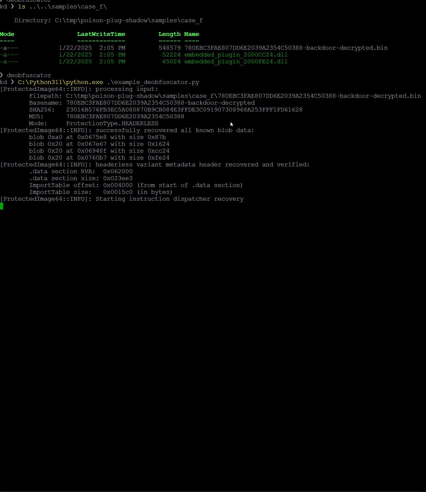
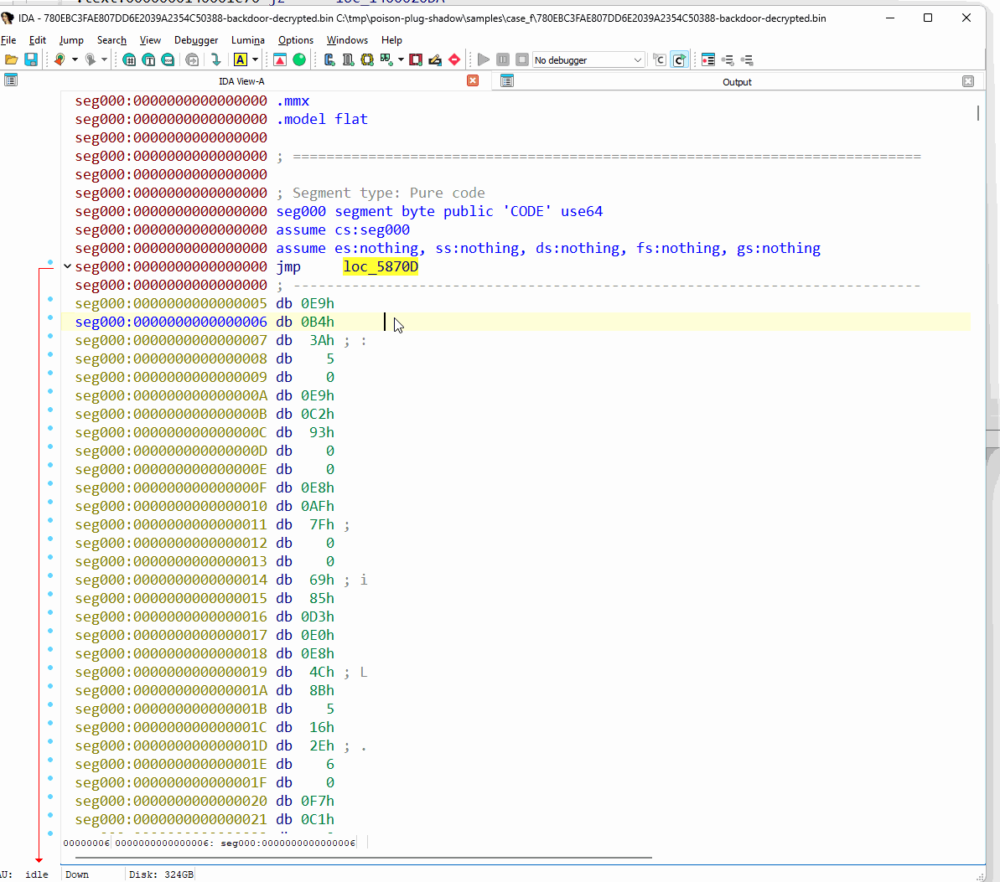
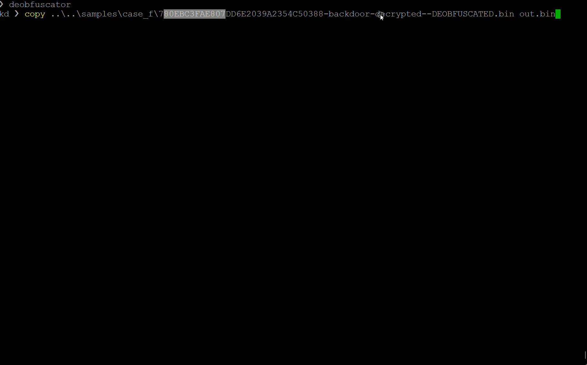

# Overview

The repo contains a Python library that provides all of the facilities to comprehensively deobfuscate binaries protected by SHADOWPAD’s ScatterBrain obfuscator outlined in our blog post: [NOTE: temporary internal link_to_be_replace_with_public_link](https://docs.google.com/document/d/1Qmu27BtNC5jF6R50TcWPP4zcb2ch5dewxY8Hi6fyprY/edit?tab=t.0). 

The core logic amounts to taking a ScatterBrain-protected binary as input and producing a new, functional binary completely free of any protections as the output. This is achieved through a series of deobfuscation passes until the final, deobfuscated state is achieved. This state is then converted to a fully functional executable e.g. exe, dll.  It works for all known ScatterBrain components that we manged to uncover, which includes all droppers, backdoors, and any POISONPLUG.SHADOWPAD plugins. 

The library encapsulates the input as a `ProtectedInput` image, which is an object that knows how to properly parse ScatterBrain-produced binaries. It uses a `ProtectionType` property which identifies the protection mode utilized by the obfuscator for the provided input. The core primitives for all of this can be found in the `recover_core.py` Python file. The deobfuscation passes are implemented in any Python file prefixed with recover e.g.,
- `recover_cfg.py`: Provides the low level APIs required to remove every control flow graph (CFG) obfuscation ScatterBrain employs. This is driven via a set of “mutation rules”, which are “guides” that facilitate a “stepping” (stepping as in the debugger terminology, of ‘_stepping one instruction at a time_’) approach to removing all  CFG obfuscations.
- `recover_dispatchers.py`: Provides the APIs responsible for the “Instruction Dispatcher” protection the obfuscator employs. This is primarily achieved via using the Unicorn library to simulate the execution of every instruction dispatcher in a protected binary. It relies on the emulator wrapper found in `helpers/emu64.py`.
- `recover_functions.py`: Provides the high-level APIs responsible for recovering and rebuilding the original functions that were protected by the obfuscator. They rely on the logic outlined in `recover_cfg`.
- `recover_imports.py`:  Provides the APIs  required to restore the original imports protected by ScatterBrain. This includes support for all modes of the obfuscator, which has subtle differences on how the imports are protected. It also includes a recovered Python implementation of the string decryption algorithm used to encrypt/decrypt DLL and API names.
- `recover_output64.py`: Provides the APIs that produce the final deobfuscated image output, which includes recovered import table and accounts for all aspects to ensure the output binary is functional e.g., it can still be executed successfully with all initial logic intact. It relies on the helpers outlined in `helpers/pefile_utils.py`

# Usage 

An example usage of the library is provided as follows with the following Python code that consumes from our library. Note, we are testing these on internal samples obtained from private customers that we naturally cannot share publicly but the identical code provided below can be repurposed for any ScatterBrain-protected component. The intent is to merely show how to consume for our library.

```python
from recover.recover_core import *
from recover.recover_dispatchers import recover_instruction_dispatchers
from recover.recover_imports     import recover_imports, recover_imports_merge
from recover.recover_functions   import recover_recursive_in_full
from recover.recover_output64    import rebuild_output
#------------------------------------------------------------------------------
def CASE_F():
    """
    samples/F:
        embedded_plugin_2000CC24.dll   (complete obfuscated binaries)
        embedded_plugin_2000FE24.dll   (complete obfuscated binaries)
        780EBC3FAE807DD6E2039A2354C50388-decrypted-backdoor.bin
    """
    PATH =  r"C:/tmp/poison-plug-shadow/samples/case_f/"
    IMP_CONST = 0x6817FD83
    #---------------------------------------------------------------------------
    def TEST_HEADERLESS_BACKDOOR():
        d = ProtectedInput64(
            "".join([PATH, "780EBC3FAE807DD6E2039A2354C50388-backdoor-decrypted.bin"]),
            ProtectionType.HEADERLESS,
            imp_decrypt_const=IMP_CONST,
            mutation_rules=RUL e_SET_1)
        #--------------------------------------------------------------------------
        recover_instruction_dispatchers(d)
        assert len(d.dispatcher_locs) == 0x4090, f'length is {len(d.dispatcher_locs)}'
        #--------------------------------------------------------------------------
        recover_imports_merge(d)
        assert len(d.imports) == 0x46f, f'import length is {len(d.imports)}'
        d.log.info(f"Recovered {len(d.imports)} protected imports")
        #--------------------------------------------------------------------------
        d.cfg = recover_recursive_in_full(d, 0)
        assert len(d.cfg.items()) == 495, "failed to recover known function amount"
        d.log.info(f"Recovered {len(d.cfg.items())} protected functions.")
        #--------------------------------------------------------------------------
        rebuild_output(d)
        d.dump_newimgbuffer_to_disk()
        #--------------------------------------------------------------------------
        d.log.info("Done\n" + "="*90)
    #---------------------------------------------------------------------------
    def TEST_PLUGINS():
        d1: ProtectedInput64 = ProtectedInput64(
            "".join([PATH, "embedded_plugin_2000CC24.dll"]),
            ProtectionType.FULL,
            imp_decrypt_const=IMP_CONST,
            mutation_rules=RULE_SET_1)
        d2: ProtectedInput64 = ProtectedInput64(
            "".join([PATH, "embedded_plugin_2000FE24.dll"]),
            ProtectionType.FULL,
            imp_decrypt_const=IMP_CONST,
            mutation_rules=RULE_SET_1)
        #-----------------------------------------------------------------------
        recover_instruction_dispatchers(d1)
        recover_instruction_dispatchers(d2)
        assert len(d1.dispatcher_locs) == 1332
        assert len(d2.dispatcher_locs) == 1883
        #-----------------------------------------------------------------------
        recover_imports_merge(d1)
        recover_imports_merge(d2)
        assert len(d1.imports) == 76
        assert len(d2.imports) == 84
        #-----------------------------------------------------------------------
        d1.cfg = recover_recursive_in_full(d1, d1.pe.OPTIONAL_HEADER.AddressOfEntryPoint)
        d2.cfg = recover_recursive_in_full(d2, d2.pe.OPTIONAL_HEADER.AddressOfEntryPoint)
        assert len(d1.cfg.items()) == 35
        assert len(d2.cfg.items()) == 60
        #-----------------------------------------------------------------------
        rebuild_output(d1)
        rebuild_output(d2)
        d1.dump_newimgbuffer_to_disk()
        d2.dump_newimgbuffer_to_disk()
        #-----------------------------------------------------------------------
        d1.log.info("Done\n" + "="*90)

    TEST_HEADERLESS_BACKDOOR()
    TEST_PLUGINS()
#-------------------------------------------------------------------------------
CASE_F()
```

If we save the above code in a file called `example_deobfuscator.py` and run it against the samples hardcoded within, we'll see the following. Notice the slight delay, given it has to emulate over 16k instruction dispatchers that were recovered.



Before inspecting the output for one of the deobfuscated binares (we'll just focus on the headerless backdoor, for the example), let us first observe one of them inside IDA so we can do a before and after comparison.



An obfuscated headerless backdoor is virtually impenetrable for either static or automatic analysis. We are immediately hit with the results of the CFG obfuscation that completely scatters the control flow of the binary. Let's compare it with the deobfuscated output.


The distinction is night and day. We now have complete visibility into the obfuscated binary. And not only have we completely removed the obfuscation but we also produced a functional binary that can either be further detonated for any kind of dynamic analysis, or simply loaded into a debugger for a more controlled dynamic analysis. We opt for the latter below:


